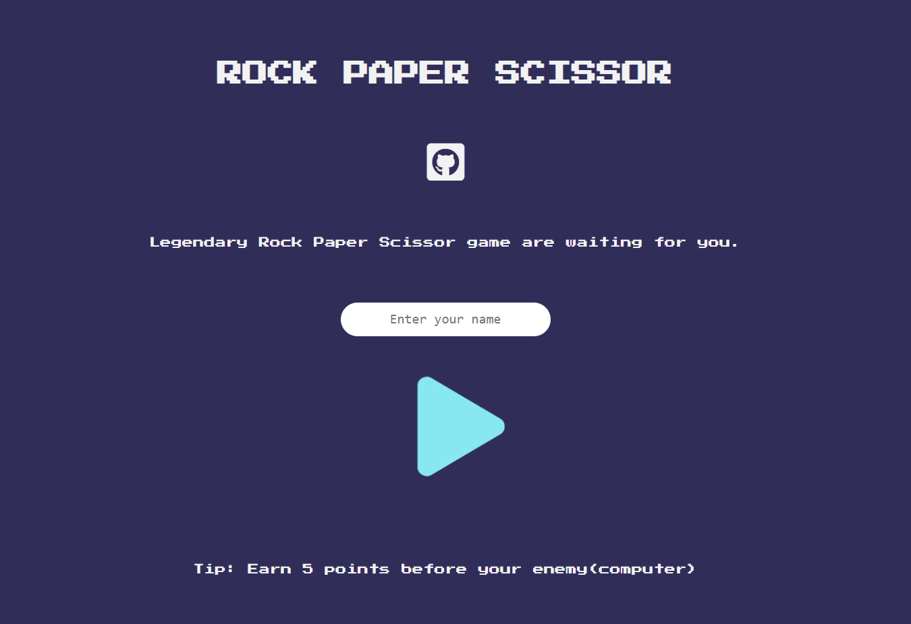
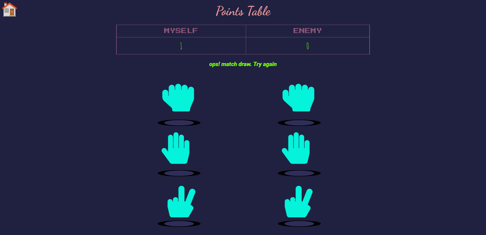
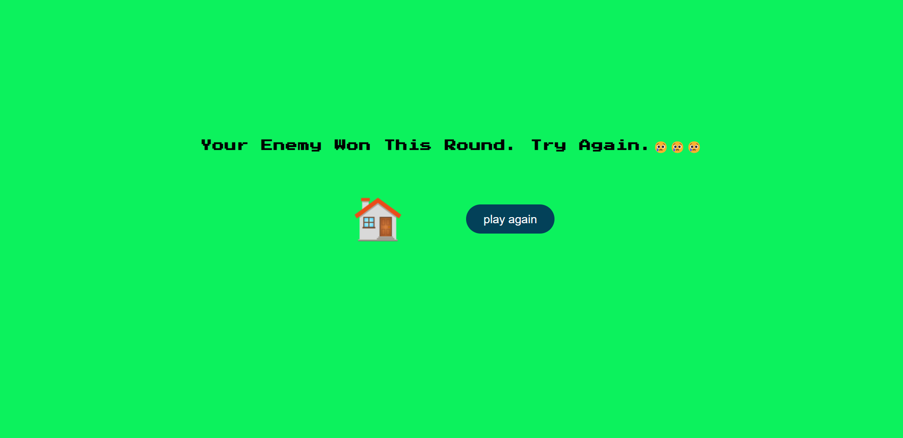

<h1 align="center">Rock Paper Scissor</h1>

  <h3>
  <!--add netlify link here-->
    <a href="https://rock-paper-scissor-2021.netlify.app/">
      Live Demo
    </a>
  </h3>

<!-- TABLE OF CONTENTS -->

## Table of Contents

- [Overview](#overview)
- [Built With](#built-with)
- [Features](#features)
- [Contact](#contact)

<!-- OVERVIEW -->

## Overview

### Built With

- HTML5
- CSS3
- CSS grid
- CSS flex
- CSS animation
- CSS transition
- JAVASCRIPT
- Mobile-first workflow

## Features

This game was created as a task from [the odin project](https://www.theodinproject.com/). 

I have divided the whole game into three pages.

Front page --> It is the landing page of the game. Here you can give your name as an input. 
Game page --> In this page you can play the game. 
End page --> Here you will see your results.

## Contact

- GitHub [@coder71-bd](https://github.com/coder71-bd)
